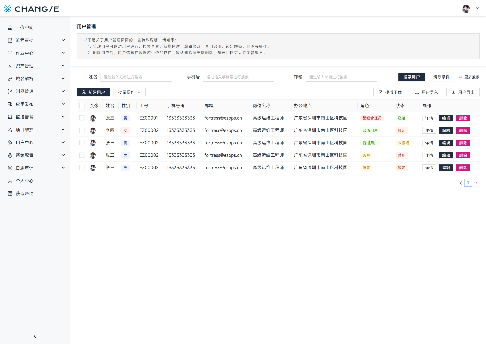

<h1 align="center">REACT ANTD ADMIN DEMO</h1>
<h3 align="center">一个通过 Vite / React / Antd 实现的运维管理系统前端示例</h3>
<p align="center">
<a href="https://github.com/goer3/react-admin-demo/fork" target="blank">

</a>
<a href="https://github.com/goer3/react-admin-demo/stargazers" target="blank">

</a>
<a href="https://github.com/goer3/react-admin-demo/issues" target="blank">

</a>
</p>

<hr>

### 🤔 技术栈

- [x] Vite：新型前端构建工具，能够显著提升前端开发体验。 [:octocat:](https://github.com/vitejs/vite)
- [x] React：由 Facebook 开源的一个进行创建用户界面的一款 JavaScript 库。
- [x] Antd：基于 React 的前端 UI 组件库，由蚂蚁金服开发并提供维护。

<br>

### 🎯 依赖安装

```bash
# 安装 cnpm
npm i -g cnpm

# 自动格式化代码
cnpm i --save-dev --save-exact prettier
cnpm i --save-dev @types/node 

# 字体安装
cnpm i misans

# 基础开发依赖
cnpm i antd@4.24.14
cnpm i @ant-design/icons
cnpm i react-router
cnpm i react-router-dom
cnpm i less less-loader
cnpm i axios
cnpm i valtio
cnpm i moment
```

<br>

### 🎯 效果演示

